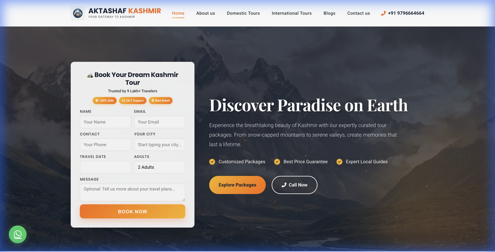
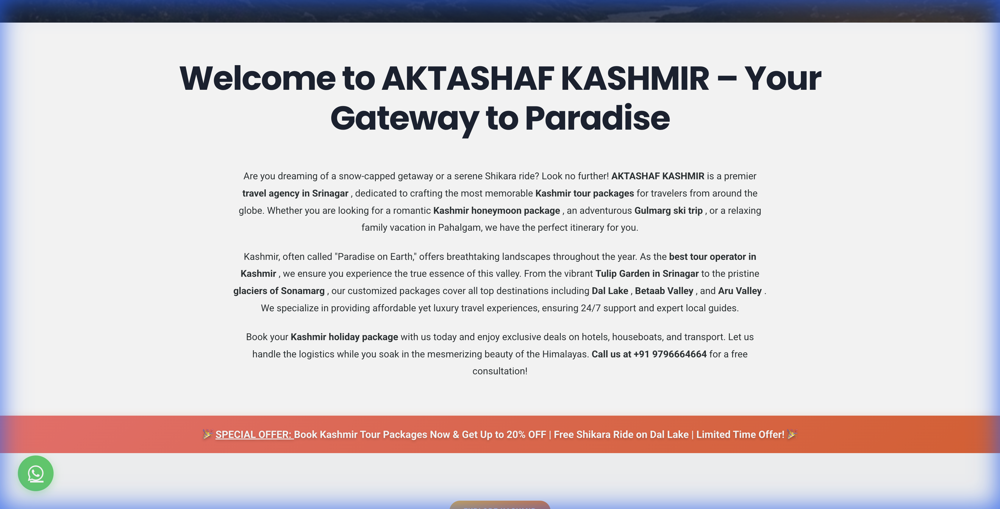
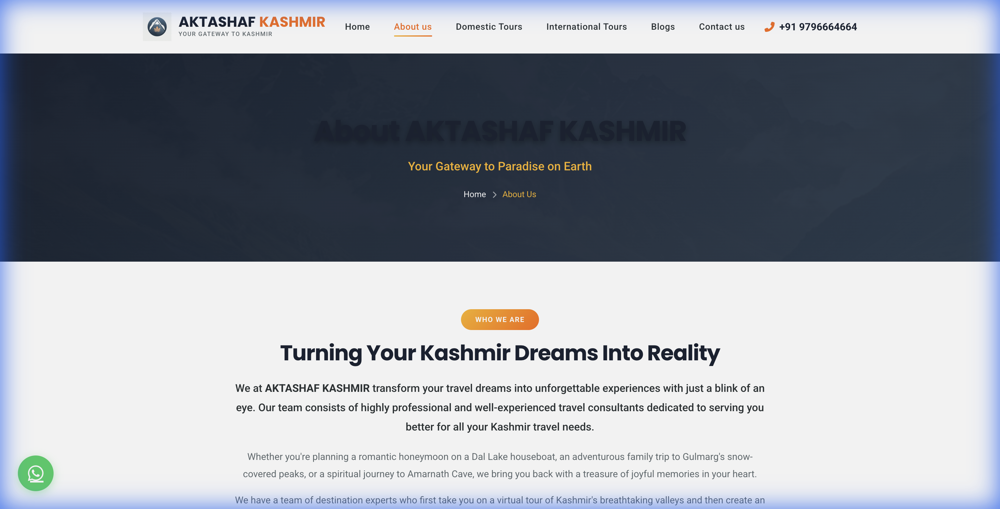
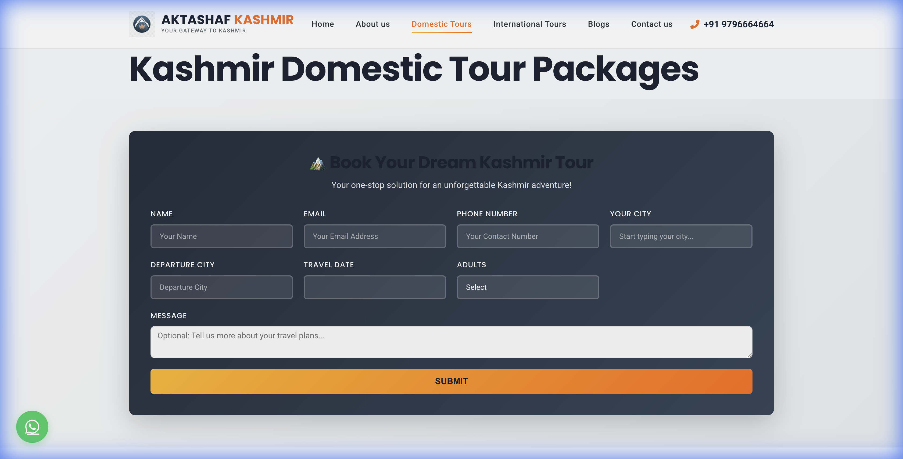

# Aktashaf Kashmir - Travel & Tourism Website

> [!CAUTION]
> **Copyright Notice**: This project and its design are proprietary and copyrighted. All rights reserved. This repository is for **portfolio showcase purposes only**. Unauthorized copying, modification, or use of this design is strictly prohibited.

## 🎯 Project Overview
**Aktashaf Kashmir** is a comprehensive travel agency website dedicated to showcasing the breathtaking beauty of Kashmir. The website allows users to explore tour packages, read travel blogs, and book their dream vacations.

The design focuses on using high-impact imagery and a warm, inviting color palette to evoke the feeling of adventure and hospitality.

## 🚀 Live Website
[https://aktashafkashmir.com](https://aktashafkashmir.com)

## 💻 Technology Stack
- **Frontend**: HTML5, CSS3, JavaScript
- **Features**: Tour package listings, contact forms, blog integration
- **Design**: Visual storytelling through imagery

## ✨ Key Features
- **Immersive Hero Section**: Captures the user's attention immediately with stunning landscapes.
- **Package Browsing**: Easy navigation to find domestic and international tour packages.
- **Trust Building**: Sections for customer testimonials and agency story.
- **Mobile Responsive**: Perfect experience on all devices for travelers on the go.

## 📸 Design Showcase

### Homepage

### Experience Section

### About Us

### Service Tours

## 📧 Contact
For inquiries about this project or to discuss potential collaborations, please reach out via GitHub or my professional email.

---

**Note**: Source code is not available in this repository to protect client intellectual property. This repository serves as a design and development showcase.
